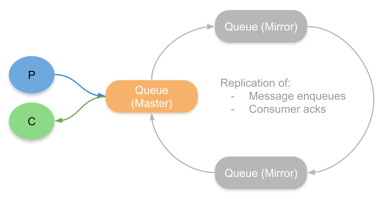
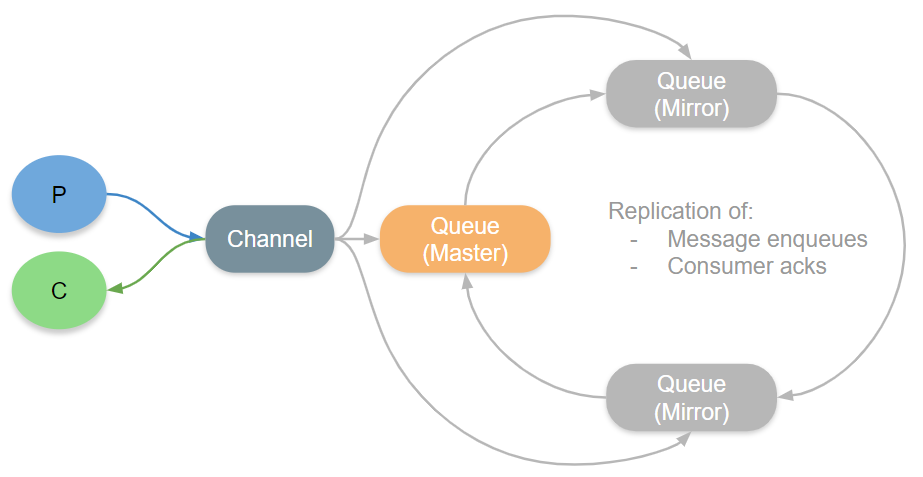

Let's talk about classic mirrored queues in Rabbitmq.

### To start with, what is even a Queue ?

A queue is an ordered collection of messages. Messages can be either enqueued or dequeued from a queue. Usually a queue is tied to a single node and stores the messages. 

But if high availability of the messages is necessary, then a different approach should be taken. Mirrored Queues. Yes, as the name suggests, the queues have to mirrored into different copies in order to keep it highly available. These mirrors have to placed in different brokers so that a failure of one broker won't result in a data loss.

Among these redundant copies of the same queue, one copy will act as the Master queue and the other copies are called Mirror queues.

### How is data synchronised between the Master queue and the Mirrors ?

Rabbitmq uses the **Chain Replication Algorithm** to synchronise data between the masters and the mirrors. 

When a message is published to the master, the master queue forwards the message to its next mirror in the chain. The mirror processes the message and forwards the message to the next mirror in the chain. This continues until the last mirror in the chain notifies the master that the operation is fully replicated. Thus a ring is formed between the master queue and the mirrors.

Let's talk about our first problem in Mirrored queues. During some edge cases when produced message loss, this algorithm is changed so that the publisher channel process would additionally send the message directly to the mirror in addition to publishing to the master. This means that the message has to be forwarded twice in the ring and this is going to make a lot of network calls between the brokers.

***Note: Usually the messages are produced to and consumed from the Queue that acts as the master.***

